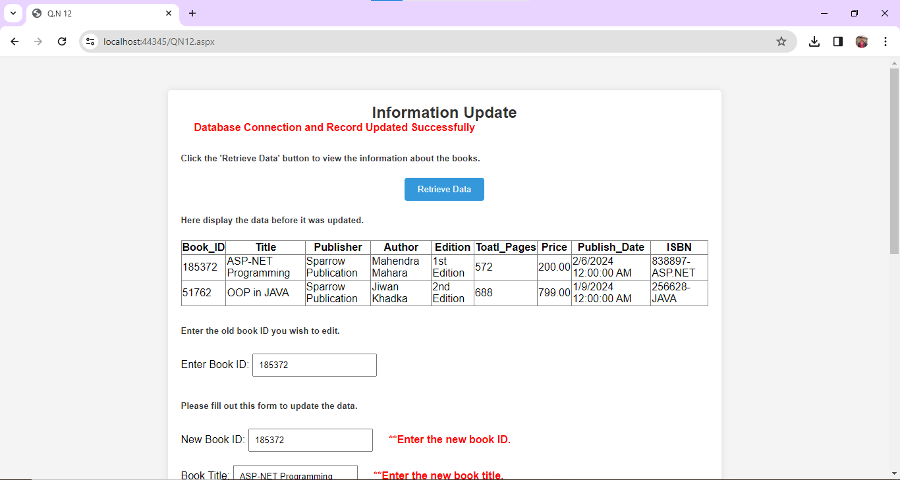
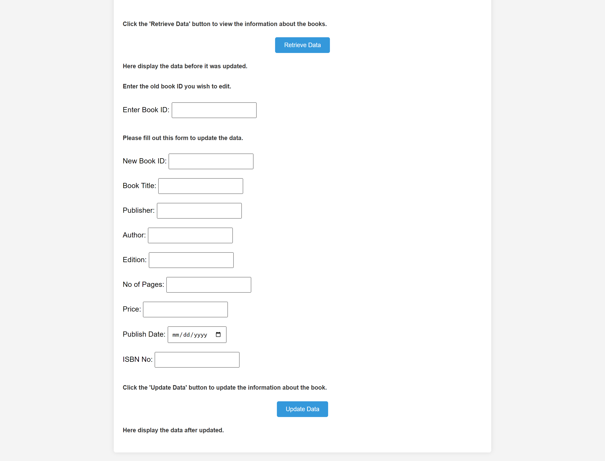

# Books Data Modification Server-Side Script

This repository contains the server-side script for modifying books data stored from the previous question (Question No. 11).

## Getting Started

To get started with this program, follow these steps:

1. Clone this repository to your local machine.
2. Ensure you have the necessary dependencies installed.
3. Run the server-side program.
4. Access the calculator form through the provided URL.
5. Input values in the designated field and press the appropriate button to calculate the result.

## Dependencies

Make sure you have the following dependencies installed:

- [ASP.NET](https://dotnet.microsoft.com/apps/aspnet) - Web framework for building modern web apps and services with .NET
- [C#](https://docs.microsoft.com/en-us/dotnet/csharp/) - Modern, general-purpose programming language
- [HTML](https://developer.mozilla.org/en-US/docs/Web/HTML) - Standard markup language for creating web pages
- [CSS](https://developer.mozilla.org/en-US/docs/Web/CSS) - Style sheet language used for describing the presentation of a document written in HTML
- [MySQL Database Management System](https://www.mysql.com/) - Open-source relational database management system.

## Books Data Modification

The server-side script provides functionalities to modify books data stored in the database. This may include updating existing book records with new information, deleting books from the database, or adding new books to the collection.

- **id**: Unique identifier for each book.
- **title**: Title of the book.
- **publisher**: Publisher of the book.
- **author**: Author(s) of the book.
- **edition**: Edition of the book.
- **number of pages**: Total number of pages in the book.
- **price**: Price of the book.
- **publish date**: Date when the book was published.
- **ISBN**: International Standard Book Number for the book.

## Contributing

If you'd like to contribute to this project, please follow these guidelines:

1. Fork the repository.
2. Create your feature branch (`git checkout -b QN12/QN12`).
3. Commit your changes (`git commit -am 'Add some feature'`).
4. Push to the branch (`git push origin QN12/QN12`).
5. Create a new Pull Request.

## License

This project is licensed under the [MIT License](MIT-LICENSE). This means the project is free for anyone to clone or use for their own projects.
