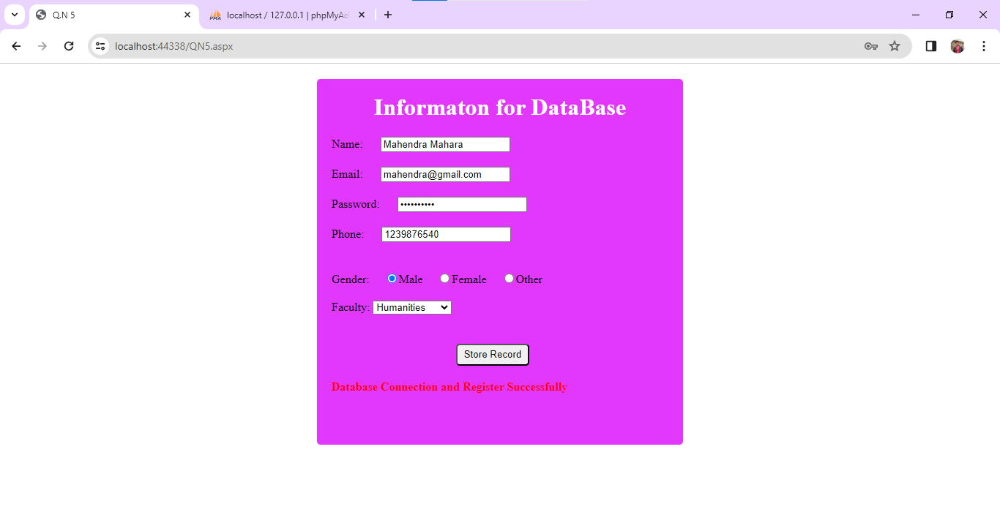

# User Registration Web Page

This repository contains a simple web page that allows users to input their name, email, password, phone number, gender, and faculty. The input is validated and stored in the "registrations" table of the database.

## Getting Started

To get started with this program, follow these steps:

1. Clone this repository to your local machine.
2. Ensure you have the necessary dependencies installed.
3. Run the server-side program.
4. Access the calculator form through the provided URL.
5. Input values in the designated field and press the appropriate button to calculate the result.

## Dependencies

Make sure you have the following dependencies installed:

- [ASP.NET](https://dotnet.microsoft.com/apps/aspnet) - Web framework for building modern web apps and services with .NET
- [C#](https://docs.microsoft.com/en-us/dotnet/csharp/) - Modern, general-purpose programming language
- [HTML](https://developer.mozilla.org/en-US/docs/Web/HTML) - Standard markup language for creating web pages
- [CSS](https://developer.mozilla.org/en-US/docs/Web/CSS) - Style sheet language used for describing the presentation of a document written in HTML
- [MySQL Database Management System](https://www.mysql.com/) - Open-source relational database management system.

## Validation and Database Storage

The web page validates user input to ensure the following:

- Name: Should not be empty.
- Email: Should be in a valid email format.
- Password: Should meet minimum length requirements.
- Phone: Should be a valid phone number format.
- Gender: Should be selected from predefined options.
- Faculty: Should be selected from predefined options.

After validation, the user information is stored in the "registrations" table of the database.

## Contributing

If you'd like to contribute to this project, please follow these guidelines:

1. Fork the repository.
2. Create your feature branch (`git checkout -b QN5/QN5`).
3. Commit your changes (`git commit -am 'Add some feature'`).
4. Push to the branch (`git push origin QN5/QN5`).
5. Create a new Pull Request.

## License

This project is licensed under the [MIT License](MIT-LICENSE). This means the project is free for anyone to clone or use for their own projects.
