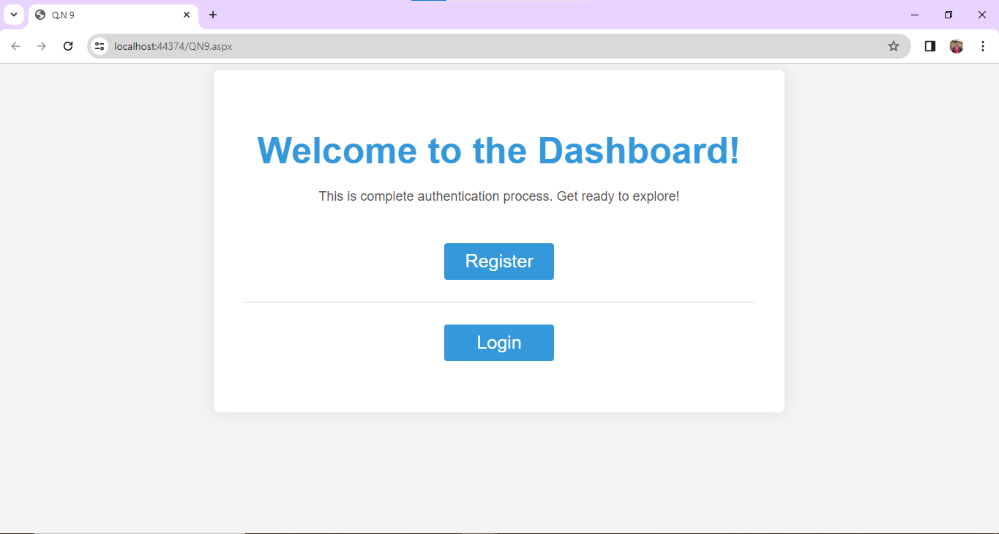
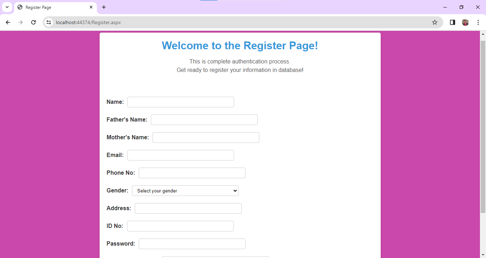
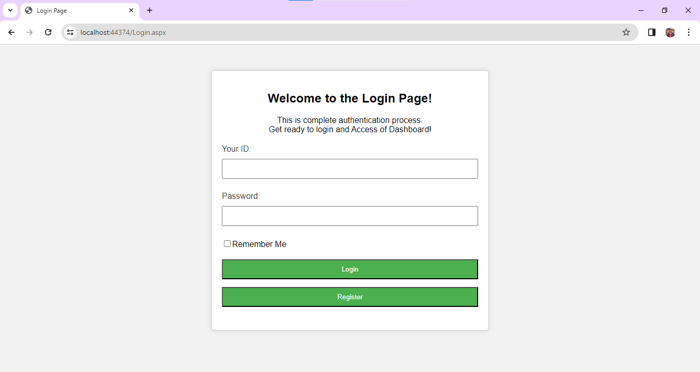
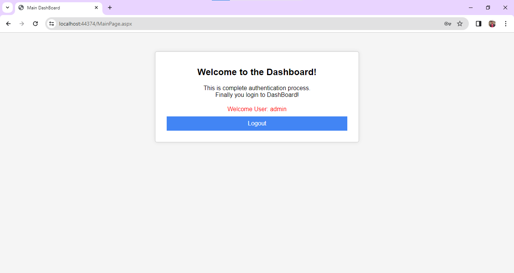

# Authentication Server-Side Script

This repository contains the server-side script for a complete authentication process, including registration, login, access of dashboard, session and cookie storage, and logout functionalities.

## Getting Started

To get started with this program, follow these steps:

1. Clone this repository to your local machine.
2. Ensure you have the necessary dependencies installed.
3. Run the server-side program.
4. Access the calculator form through the provided URL.
5. Input values in the designated field and press the appropriate button to calculate the result.

## Dependencies

Make sure you have the following dependencies installed:

- [ASP.NET](https://dotnet.microsoft.com/apps/aspnet) - Web framework for building modern web apps and services with .NET
- [C#](https://docs.microsoft.com/en-us/dotnet/csharp/) - Modern, general-purpose programming language
- [HTML](https://developer.mozilla.org/en-US/docs/Web/HTML) - Standard markup language for creating web pages
- [CSS](https://developer.mozilla.org/en-US/docs/Web/CSS) - Style sheet language used for describing the presentation of a document written in HTML
- [MySQL Database Management System](https://www.mysql.com/) - Open-source relational database management system.

## Authentication Process

The server-side script implements the following steps for the authentication process:

1. **Registration**: Allows users to register by providing necessary information such as name, email, and password. The registration data is stored in the database.
2. **Login**: Authenticates users based on their email and password. Upon successful login, session and/or cookie data is created to maintain the user's authentication status.
3. **Access of Dashboard**: Provides authenticated users access to a dashboard where they can view their account information or perform specific actions.
4. **Session and Cookie Storage**: Manages session and cookie data to maintain user authentication across multiple requests and sessions.
5. **Logout**: Allows users to log out of their accounts, destroying session and cookie data and redirecting them to a logout page or the login page.

## Contributing

If you'd like to contribute to this project, please follow these guidelines:

1. Fork the repository.
2. Create your feature branch (`git checkout -b QN9/QN9`).
3. Commit your changes (`git commit -am 'Add some feature'`).
4. Push to the branch (`git push origin QN9/QN9`).
5. Create a new Pull Request.

## License

This project is licensed under the [MIT License](MIT-LICENSE). This means the project is free for anyone to clone or use for their own projects.
